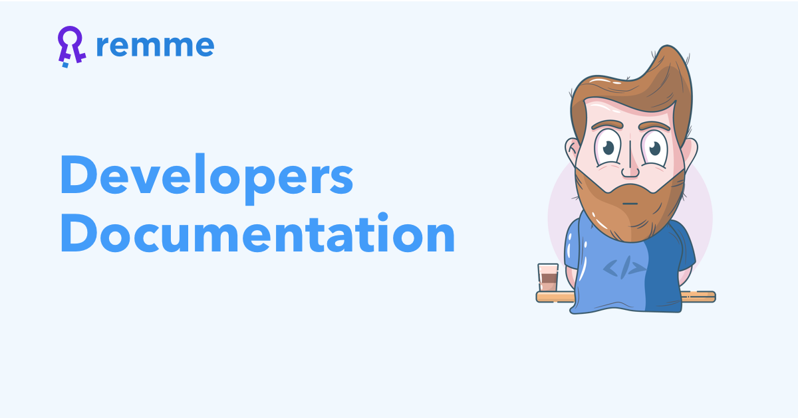

.. Remme Client Python documentation master file, created by
   sphinx-quickstart on Thu Feb 21 17:46:12 2019.
   You can adapt this file completely to your liking, but it should at least
   contain the root `toctree` directive.

Welcome to Remme's Client Python documentation!
===============================================

.. toctree::
   :maxdepth: 3

   introduction
   user_guide
   example
   api/general
   models/models
